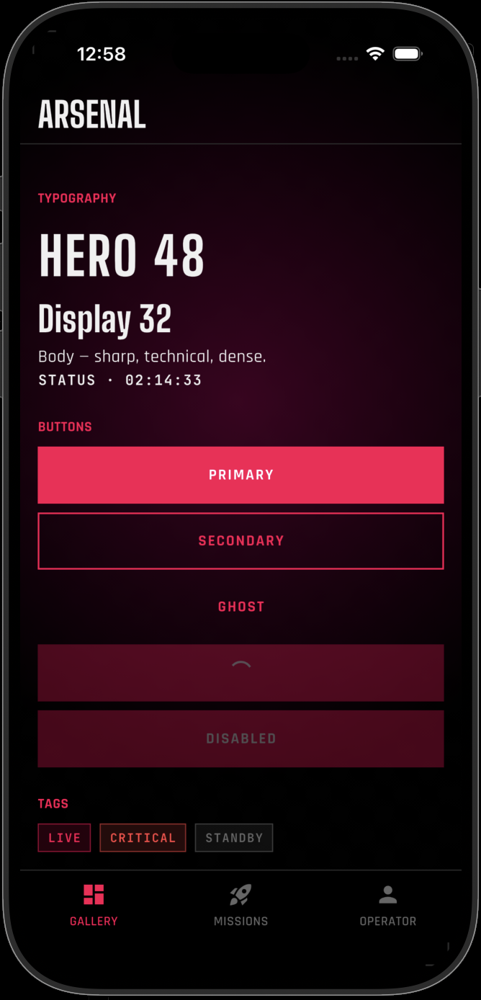
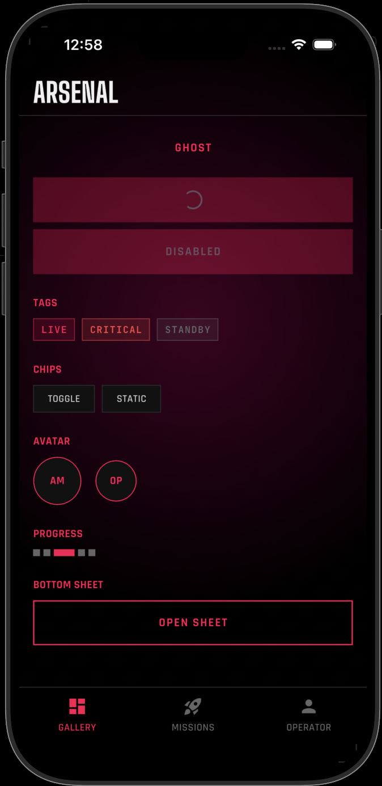
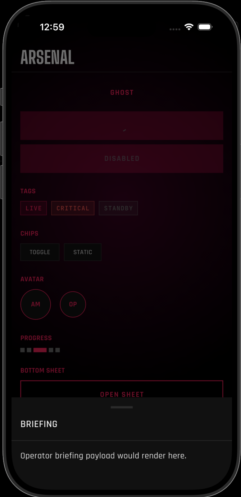
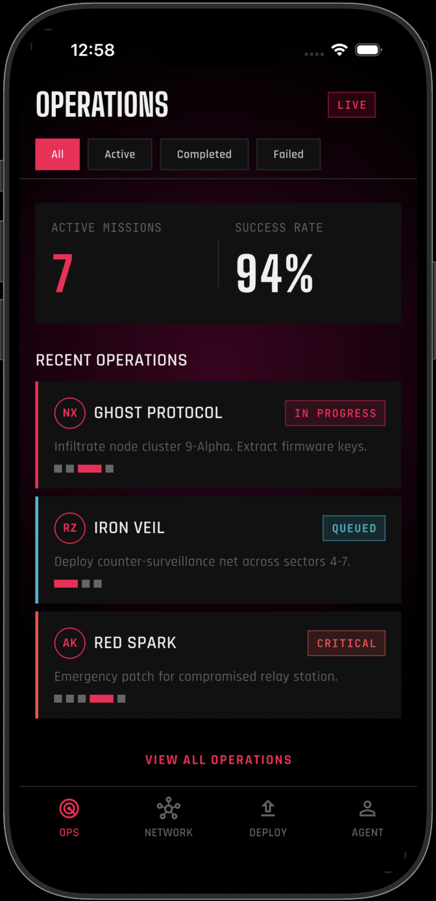
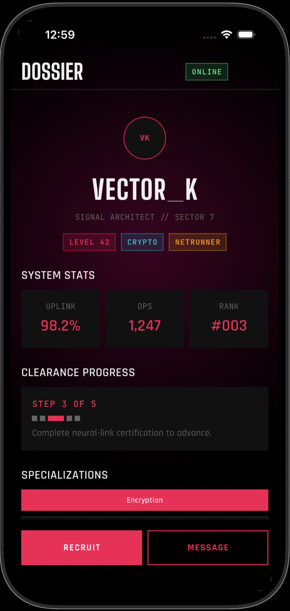

# Arsenal

A cyberpunk-inspired Flutter design system. Components, theme, typography, and bundled display fonts in one drop-in package.

<p align="center">
  
  
  
</p>
<p align="center">
  
  
</p>

```yaml
dependencies:
  arsenal:
    path: ../arsenal   # or git: ... — pub.dev release pending
```

```dart
import 'package:arsenal/arsenal.dart';

MaterialApp(
  theme: arsenalTheme(),
  home: ArScaffold(
    appBar: ArAppBar(title: 'MISSION CONTROL'),
    body: ArButton(label: 'ENGAGE', onPressed: () {}),
  ),
);
```

## What's inside

- **Components:** `ArAppBar`, `ArAvatar`, `ArBottomNav`, `ArBottomSheet`, `ArButton`, `ArChip`, `ArProgressSteps`, `ArScaffold`, `ArTag`.
- **Tokens:** `ArsenalColors`, `ArsenalSpacing`, `ArsenalTypography`.
- **Theme:** `arsenalTheme()` returns a ready-to-use `ThemeData`.
- **Fonts (bundled):** BigShouldersDisplay, Rajdhani, JetBrainsMono.

## Example

A runnable demo app lives in [`example/`](./example):

```bash
cd example
flutter run
```

## License

BSD 3-Clause. See [LICENSE](./LICENSE).
